# Digital Library Management System

## 📚 Project Overview

The Digital Library Management System is a web-based application developed using Java and Spring Boot.

The system provides separate Admin and User roles to manage books, issue and return operations, reservations, fines, and contact queries.

---

## 🚀 Features

### 👨‍💼 Admin Module

- Admin Login
- Add New Books
- Edit Existing Books
- Delete Books
- View Issued Books
- View Due Dates
- Manage Registered Users
- Manage Fines
- Mark Fines as Paid
- View Contact/Query Messages

### 👤 User Module

- User Registration
- User Login
- User Dashboard
- Browse Books
- Search Books by Title or Author
- Browse Books by Category
- Issue Books
- Return Books
- Automatic Fine Generation for Overdue Books
- Advance Book Reservation
- Submit Contact/Query

---

## 🔄 Book Reservation Flow

The reservation system follows this workflow:

PENDING → APPROVED → READY → COMPLETED

A reserved book becomes READY only after the current borrower returns the book.

---

## 💰 Fine Management

The system automatically calculates fines for overdue books.

Example:

- Fine rate: ₹5 per overdue day
- Overdue days × ₹5 = Fine Amount

Admin can mark generated fines as PAID.

---

## 🛠️ Technologies Used

- Java
- Spring Boot
- Spring Security
- Spring Data JPA
- Hibernate
- MySQL
- HTML
- CSS
- Thymeleaf
- Maven

---

## 🗄️ Database

The application uses MySQL as the database.

Main tables include:

- `users`
- `books`
- `book_issues`
- `book_reservations`
- `fines`
- `contact_queries`

---

## 📂 Project Structure

```text
Digital-Library-Management-System/
│
├── src/
│   ├── main/
│   │   ├── java/
│   │   │   └── com/library/
│   │   │       ├── config/
│   │   │       ├── controller/
│   │   │       ├── entity/
│   │   │       ├── repository/
│   │   │       └── service/
│   │   │
│   │   └── resources/
│   │       ├── templates/
│   │       ├── static/
│   │       └── application.properties
│
├── screenshots/
│
├── pom.xml
└── README.md

##▶️ How to Run the Project
1. Clone the Repository

Clone the project from GitHub.

2. Configure MySQL

Create a MySQL database:

CREATE DATABASE digital_library;
3. Configure Database Connection

Update the database username and password in:

src/main/resources/application.properties
4. Run the Application

Run the Spring Boot application from your IDE or using Maven.

5. Open in Browser
http://localhost:8080/
👥 User Roles
Admin

The Admin has access to book management, users, issued books, fines, and contact queries.

User

Users can register, login, browse/search books, issue and return books, reserve books, and submit queries.

## 📸 Screenshots

### 🏠 Home Page


### 📝 User Registration
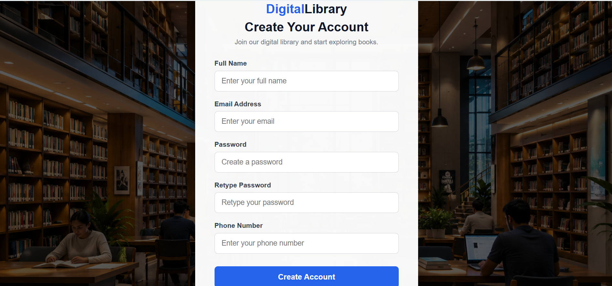

### 🔐 User Login
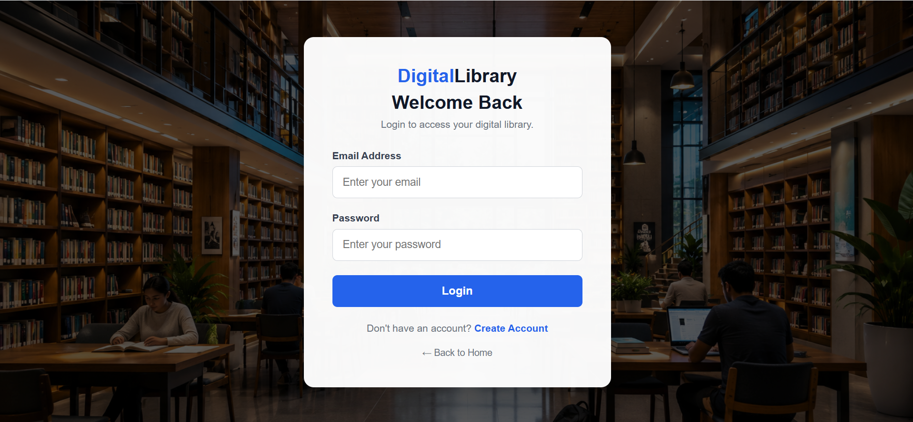

### 👤 User Dashboard
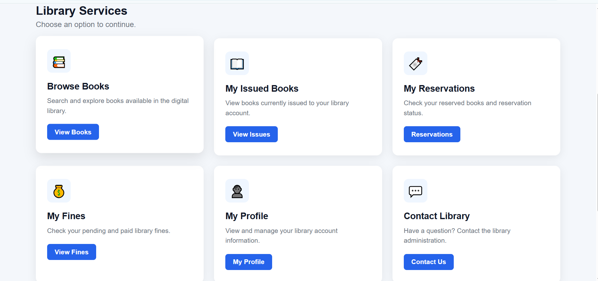

### 📚 All Books
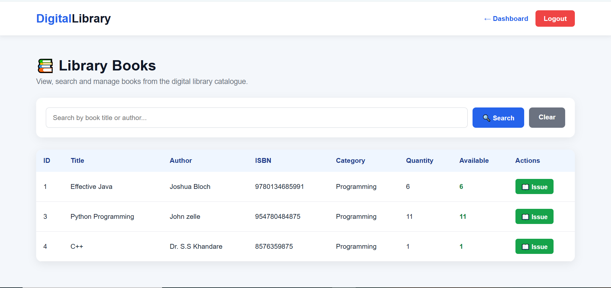

### 🔎 Search Book
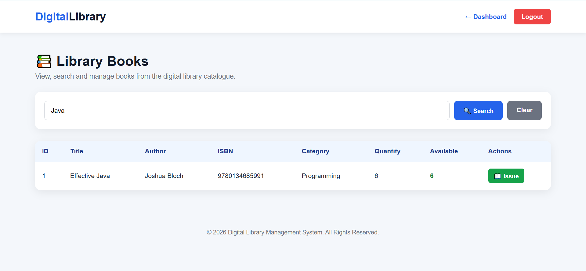

### 📖 Issue Book
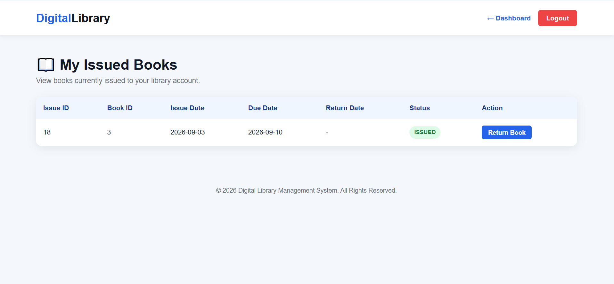

### ↩️ Return Book
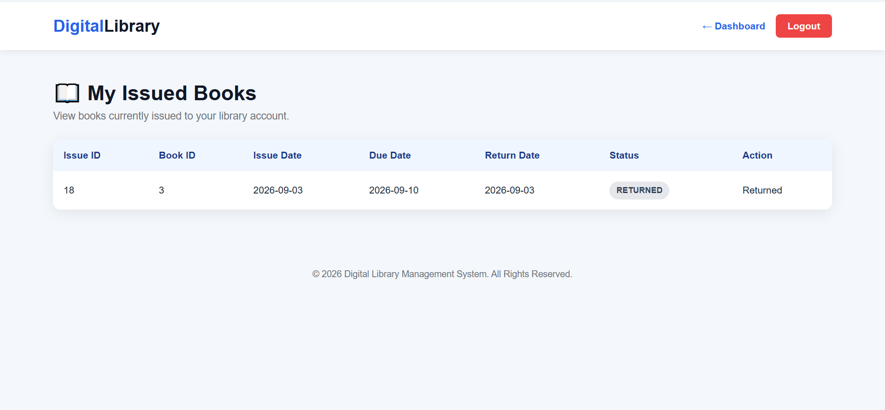

### 📌 Reserve Book
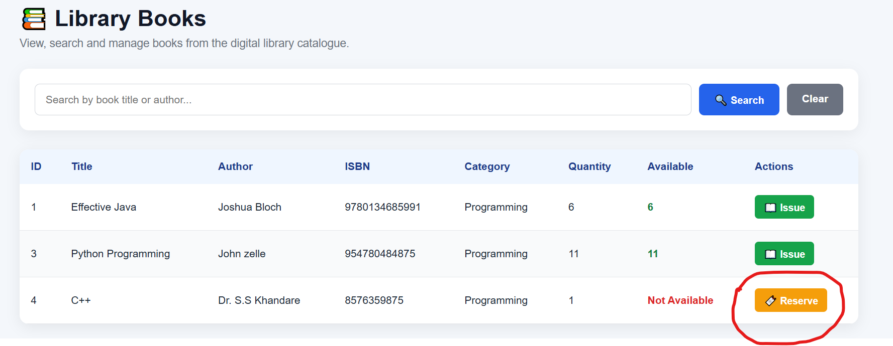

### 📋 Reservation Status
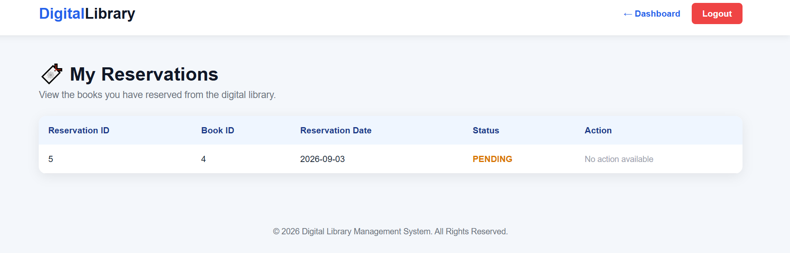

### 💰 Fine Management
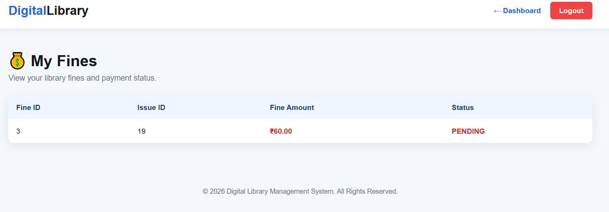

### 👨‍💼 Admin Dashboard
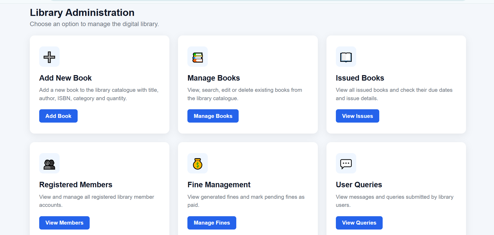

### 📚 Book Management
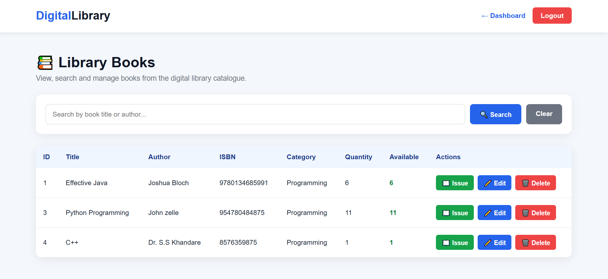

### 👥 Users / Members Management
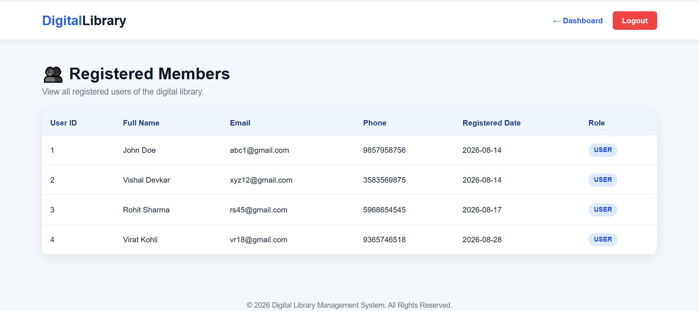

### 📩 Contact / Query Form
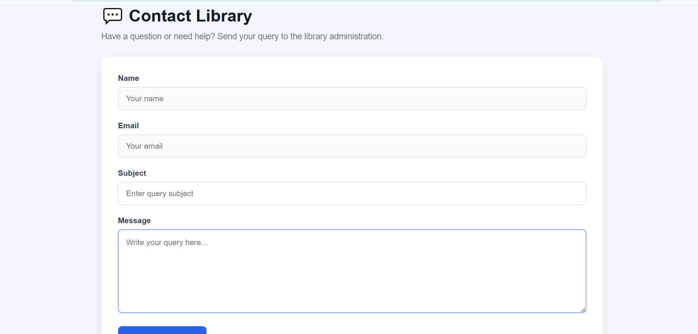

### 📬 Admin Contact Queries
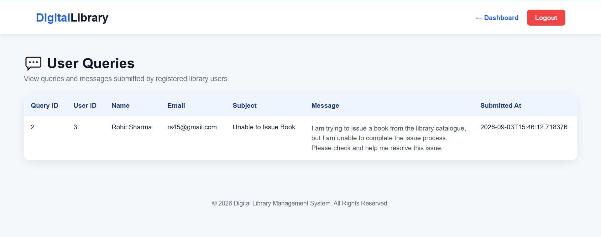
🎯 Project Objective

To build a web-based library management system that manages a catalogue of books, handles issuing and returns, tracks fines, supports advance bookings, and provides separate Admin and User functionality.

👨‍💻 Developed By

Vishal Devkar

Java Development – Task 5

Oasis Infobyte Internship